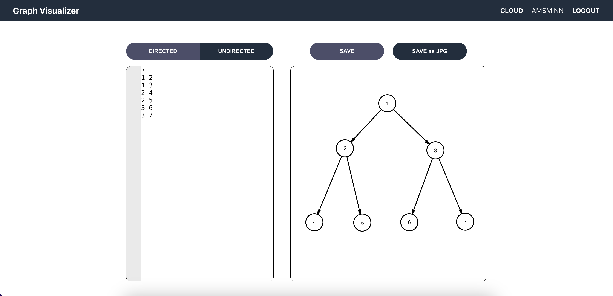

# Graph Visualizer


인접 리스트의 데이터로 정점과 간선으로 이루어진 그래프를 시각화하며 이미지 저장, 클라우드 게시 기능을 지원합니다. 

## 실행 방법

### requirements
-   Express - Node.js
-   npm
-   MongoDB, mongoose

### run server
insert your MongoDB connect url in `./server/DB.js` <br/>
run `./server/server.js `
```
cd server
npm i
node app
```

### run client
run React Project `./graph_visualizer`
```
cd graph_visualizer
npm i
npm start
```